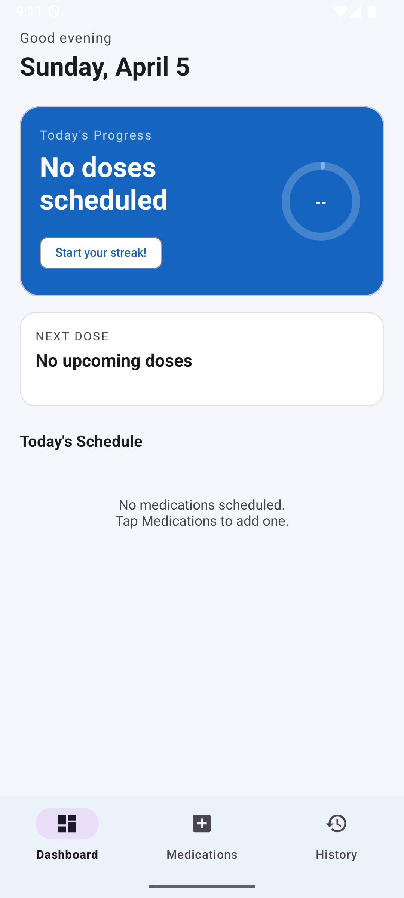
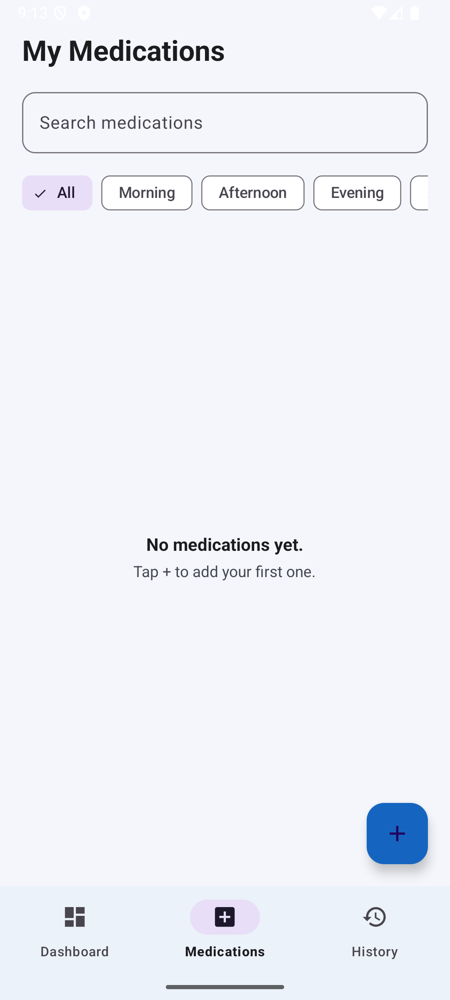
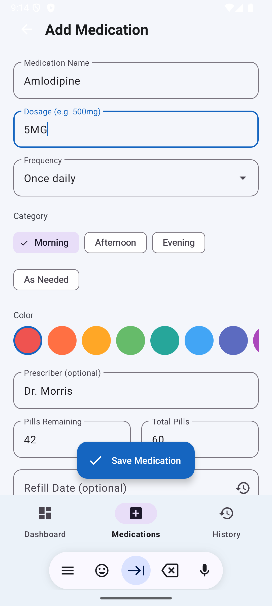
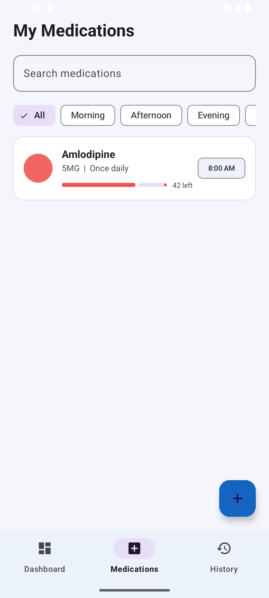
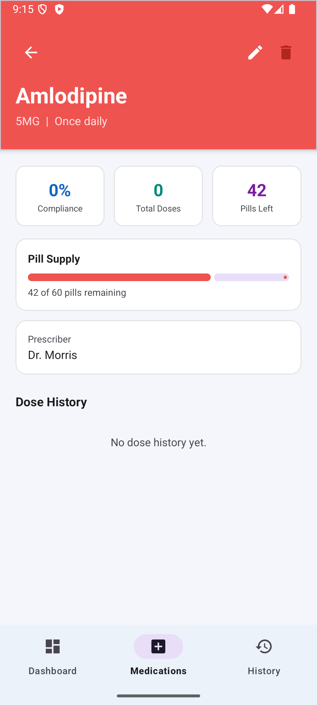

# MediTrack

A medication management Android app built to help users track their daily doses, monitor pill supply, and stay consistent with their health routines.

---

## Features

- **Dashboard** — Daily progress ring showing doses taken vs. scheduled, streak counter, and next dose preview
- **Medication Management** — Add, edit, and organize medications with custom color tags, dosage info, and frequency settings
- **Time Picker** — Set exact reminder times per dose, dynamically based on frequency
- **Dose Logging** — Mark doses as taken directly from the dashboard with one tap
- **Compliance Tracking** — Per-medication stats showing total doses taken and compliance percentage
- **Pill Supply Monitor** — Progress bar showing pills remaining with low-supply color warnings
- **Refill Tracker** — Countdown to refill date on each medication's detail screen
- **History** — Weekly compliance bar chart and recent activity log
- **Swipe to Delete** — Swipe left on any medication card to remove it, with undo support
- **Reminders** — Scheduled notifications via WorkManager that persist across device reboots
- **Dark Mode** — Full light and dark theme support

---

## Tech Stack

| Layer | Technology |
|---|---|
| Language | Java |
| Architecture | MVVM (ViewModel + LiveData) |
| Database | Room (SQLite) with relational schema |
| Navigation | Navigation Component with Safe Args |
| Background Work | WorkManager |
| UI | Material Design 3, RecyclerView, ViewBinding |
| Charts | MPAndroidChart |
| Min SDK | API 26 (Android 8.0) |

---

## Architecture

```
meditrack/
├── data/
│   ├── model/          # Medication, DoseLog entities
│   ├── dao/            # MedicationDao, DoseLogDao
│   └── db/             # MediTrackDatabase (Room)
├── repository/         # MedicationRepository
├── viewmodel/          # MedicationViewModel
├── ui/
│   ├── dashboard/      # DashboardFragment, TodayMedAdapter
│   ├── medications/    # MedicationsFragment, MedicationAdapter
│   ├── addedit/        # AddEditMedicationFragment
│   ├── detail/         # MedicationDetailFragment, DoseLogAdapter
│   └── history/        # HistoryFragment
└── util/               # DateUtils, NotificationHelper, ReminderWorker
```

---

## Screenshots

<p align="center">
  
  
  
  
  
</p>
<p align="center">
  <em>Dashboard &nbsp;&nbsp; Medications &nbsp;&nbsp; Add Medication &nbsp;&nbsp; Medication Card &nbsp;&nbsp; Detail Screen</em>
</p>

---

## Getting Started

1. Clone the repo
   ```bash
   git clone https://github.com/briannab1997/meditrack-android.git
   ```
2. Open in Android Studio
3. Sync Gradle
4. Run on an emulator or physical device (API 26+)

---

## Author

**Brianna Brockington**
[GitHub](https://github.com/briannab1997)
